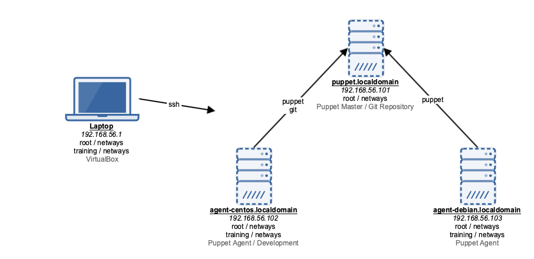

!SLIDE smbullets small noprint

# Training Environment

~~~SECTION:notes~~~

~~~ENDSECTION~~~

!SLIDE smbullets small printonly

# Training Environment

~~~SECTION:handouts~~~

****

The laptop provided for the training is running CentOS 7 with Gnome 3 in Fallback mode.

**Username:** training 
**Password:** netways 
**root Password:** netways0815

For virtualization the laptop runs Virtualbox. The virtual machines are best accessed using ssh from your
supplied laptop. Hostnames can be used for accessing the virtual machines.

**Username:** training 
**Password:** netways 
**root Password:** netways

~~~PAGEBREAK~~~

On our virtual machines you **should**:

* Work as user **training**
* Use the workspace in `/home/training/puppet`
* Switch only to root when necessary

The machine **agent-centos.localdomain** will be our first workspace and is used for:

* install Puppet as an agent
* developing Puppet code
* commit changes to a Git repository later
* publish the code to the Puppet master

On the virtual machine named **puppet.localdomain** a Puppet Master is pre-installed and a simple Git server
is ready to be used for later labs.

The last machine is **agent-debian.localdomain** which has a Puppet agent pre-installed and will
be used in the optional labs at the end.

From your training laptop you simply can SSH in to the virtual machines:

    ssh agent-centos.localdomain
    ssh puppet.localdomain
    ssh agent-debian.localdomain

If you want to do something as root, use sudo from within the virtual machines, or SSH in with the root account:

    sudo some command
    sudo -i
    ssh root@agent-centos.localdomain

~~~ENDSECTION~~~
